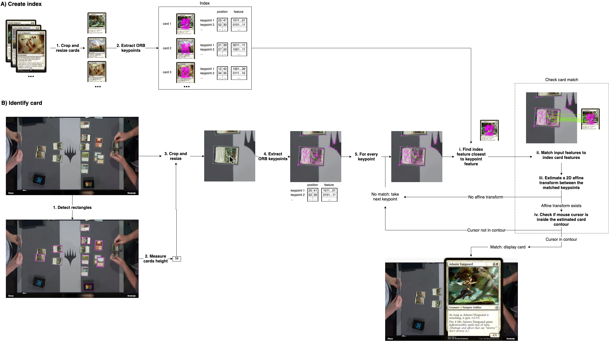

# MagicCardZoom: how it works

MagicCardZoom is a browser extension to identify _Magic: the Gathering™_ cards in videos and streams.

The way it works is by using a feature descriptor to detect points of interests (keypoints) from the video, and to match them to keypoints of cards coming from a pre-selected pool of cards.

Note that the identification process is done entirely in the browser; no data is sent over the network, and therefore the user's data is kept private.

 

### A) Create index

This part is done once before packaging the extension.

1. **Crop and resize cards**. All card images from the pool of cards (downloaded from [Scryfall](https://scryfall.com/)) are cropped around the artwork, then resized to a smaller height of *Hindex* = 70px, in order to get more relevant and fewer keypoints.

2. **Extract ORB keypoints**. ORB is a fast rotation-invariant feature descriptor (see the [original ORB paper](http://www.willowgarage.com/sites/default/files/orb_final.pdf)). We apply it to each cropped & resized card to get a list of keypoints. Each keypoint is identified by its position in the image and a feature vector of 256 bits. The keypoints of all the cards make up what we call the *index*, which is packaged inside the browser extension.

### B) Identify card

This part happens in the browser whenever the user stops their mouse over a card.

1. **Detect rectangles**. A contour detection algorithm is run, and all rectangles with a sides ratio close to _Magic: the Gathering™_ cards ratio (length / width = 1.43) are considered as potential cards.

2. **Measure cards height**. Card heights of the rectangles are measured and clustered to a list of potential card heights in the video. If there are multiple potential card heights, the steps that follow are repeated for each of the potential heights.

3. **Crop and resize**. The screenshot is cropped to a 200 x 200 px square around the cursor, and resized by a factor of *Hindex&nbsp;/&nbsp;Hscreenshot*, where *Hscreenshot* is the height of cards detected in the previous step. This ensures that the cards in the resized screenshot have the same size as the cards used to build the index, which is necessary because the ORB keypoints depend on the scale of the image.

4. **Extract ORB keypoints**. We use the same ORB descriptor as when creating the index to extract a list of keypoints from the cropped & resized image. 

5. **For every keypoint:** (ordered by closeness to cursor)

    1. **Find index feature closest to keypoint feature**. A brute force search over all the features in the index is performed to find the index feature that is the closest to the input keypoint feature (using Hamming distance). The card corresponding to that index feature is then checked for proper match in the following steps.

    2. **Match input features to index card features**. Features of the input screenshot and of the index card are matched using K-Nearest-Neighbors and ratio test (see [this OpenCV tutorial](https://docs.opencv.org/trunk/dc/dc3/tutorial_py_matcher.html) for more details).

    3. **Estimate a 2D affine transform between the matched keypoints**. Using OpenCV's [`estimateAffinePartial2D`](https://docs.opencv.org/3.4/d9/d0c/group__calib3d.html#gad767faff73e9cbd8b9d92b955b50062d) function, we compute an optimal affine transformation between the two sets of keypoint positions. If there is a reasonable transform, go to the next step. If not, the card doesn't match; repeat from step 5 using the next keypoint (if no more keypoints stop the search). A transform is considered reasonable if there are at least 4 inliers (estimated using the RANSAC method) and the scaling factor is between 0.8 and 1.2.

    4. **Check if mouse cursor is inside the estimated card contour**. Using the affine transform above, we estimate the card's contour and check if the mouse cursor is inside. If it does, the card is a match; display it to the user. If not, the card doesn't match; repeat from step 5 using the next keypoint (if no more keypoints stop the search).

